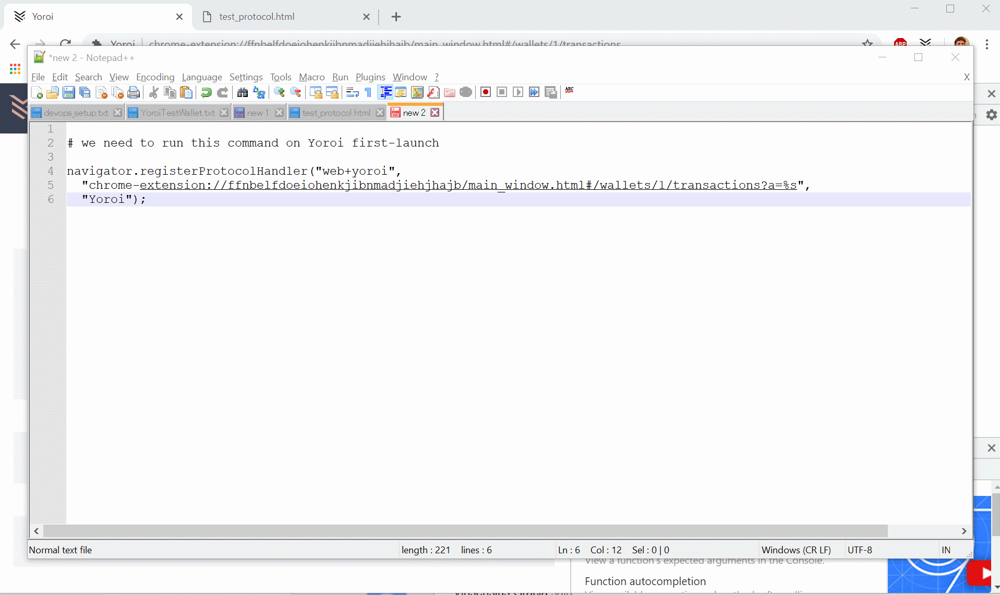
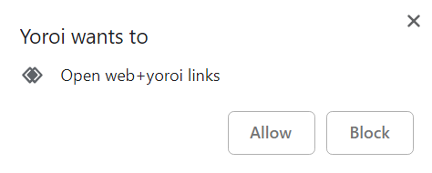

# Problem Statement

Users who create community content often want donations as a financial incentive. However, no consumer wants to
Open Daedalus as it takes too long to sync
Copy paste the user address and decide how much to send

# Motivation

Yoroi is unique in that opening our wallet is near-instant and already runs in
your browser. We hope that adding a three-click donation system would greatly
encourage adoption of Ada payments. This URI scheme would enable users to easily
make payments by simply clicking links on webpages or scanning QR Codes.

# Proof of Concept



# Core Implementation

The core implementation should follow the [BIP-21](https://github.com/bitcoin/bips/blob/master/bip-0021.mediawiki) standard (with `bitcoin:` replaced with `web-cardano:`)

Rationale:
- Use `cardano:` over `ada:` as other projects that implement this standard tend
to take the project name over the currency name (this makes sense if we consider this protocol as a generic way for interacting with the blockchain through wallets -as opposed to a simple payment system)
- Many wallets support multiple currencies. Following the same standard will ensure higher adoption of our protocol.

Example:
```
<a href="web+cardano:Ae2tdPwUPEZ76BjmWDTS7poTekAvNqBjgfthF92pSLSDVpRVnLP7meaFhVd">Donate</a>
```
## Considerations

1. BIP-21 is limited to only features Bitcoin supports. A similar feature for Ethereum would, for example, also support gas as an extra parameter. BIP-21 is easily extensible but we have to take precaution to avoid different wallets having different implementations of these features as they become available on Cardano. To get an idea of some extra features that could be added, consider this (still under discussion) proposal for Ethereum: EIP-681

2. Chrome enforces a `web+` prefix for non-whitelisted protocols (note: `bitcoin:` was whitelisted)

# Registering the protocol

## Considerations

1. Due to same-domain security policy of modern browsers, protocol handlers can only be added for the same domain the user is currently viewing
In our case, this means we can only register this protocol from within the Yoroi extension
2. Registering a new protocol prompts the user to accept:
  
3. Registering the protocol requires a specific URL.
```
navigator.registerProtocolHandler(
  "web+cardano",
  "chrome-extension://ffnbelfdoeiohenkjibnmadjiehjhajb/main_window.html#/?a=%s",
  "Yoroi");
```
## Suggested Implementation

1. Register protocol during first-boot
2. We add an explanation of this feature and what the prompt will look like. Once the user presses a “understood button”, we register the protocol causing the Chrome prompt to appear.
3. Since the extension ID is uniquely determined by the private key we use to upload our app to the Chrome store, we can safely assume it will not change and therefore we should just hard-code it.
4. The URI (which replaces the placeholder %s) should be passed as an argument to a special page in the Yoroi app and not the send page (see Future Proof section for more detail)

## Note

1. Since the user can choose “block” or remove the handler at any time from his Chrome settings, we cannot enforce this feature
2. Here is the list of browsers that support this feature: registerProtocolHandler

# Security Considerations

1. We cannot prompt the user to send the funds right away as they may not be fully aware of the URI they clicked or were redirected to. Instead, it may be better to simply pre-populate fields in a transaction.
2. We should be wary of people who disguise “donate” links as actually opening up a phishing website that LOOKS like Yoroi with the fields pre-filled.

# Future Proof Considerations

## Considerations

1. Once we pick a page in Yoroi to send users to, we cannot easily change it (since it will be baked into the protocol)
2. Before sending a transaction, the user may have to make extra choices (such as which wallet to send from if Yoroi eventually supports multiple wallets).These options should not all be listed on the “send” page

## Suggested Implementation
We should create a new page in Yoroi to handle these URI links that way we can prompt the user for additional decisions in the future before redirecting them to the appropriate page.

## Note
Users may have downloaded Yoroi and registered the protocol but have not created a wallet yet
